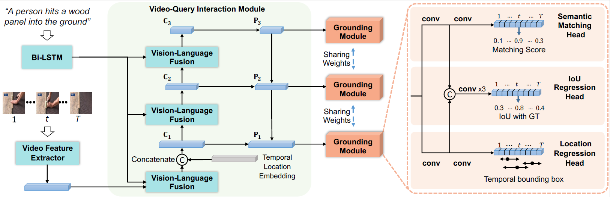

## Dense Regression Network for Video Grounding

This repo holds the codes and models for DRN presented on CVPR 2020

**Dense Regression Network for Video Grounding**
Runhao Zeng, Haoming Xu, Wenbing Huang, Peihao Chen, Mingkui Tan, Chuang Gan,  *CVPR2020*, Seattle, Washington.

[[Paper]](https://arxiv.org/abs/2004.03545)

In this work, we address the problem of video grounding from natural language queries. 
The key challenge in this task is that one training video might only contain a few annotated starting/ending frames that can be used as positive examples for model training. 
Most conventional approaches directly train a binary classifier using such imbalance data, thus achieving inferior results. 
The key idea of this paper is to use the distances between the frame within the ground truth and the starting (ending) frame as dense supervisions to improve the video grounding accuracy. 
Specifically, we design a novel dense regression network (DRN) to regress the distances from each frame to the starting (ending) frame of the video segment described by the query. 
Experimental results show that our approach significantly outperforms state-of-the-arts on three datasets (i.e., Charades-STA, ActivityNet-Captions, and TACoS).

## Network architecture


## Resources
We are still working on it and will release the source code soon.

## Reference
If you find our work useful, please use the following bibtex to cite our work:
```
@InProceedings{zeng2020dense,
author = {Zeng, Runhao and Xu, Haoming and Huang, Wenbing and Chen, Peihao and Tan, Mingkui and Gan, Chuang},
title = {Dense Regression Network for Video Grounding},
booktitle = {The IEEE Conference on Computer Vision and Pattern Recognition (CVPR)},
month = {June},
year = {2020}
}
```
## Contact
For any question, please file an issue or contact
```
Runhao Zeng: runhaozeng.cs@gmail.com
```